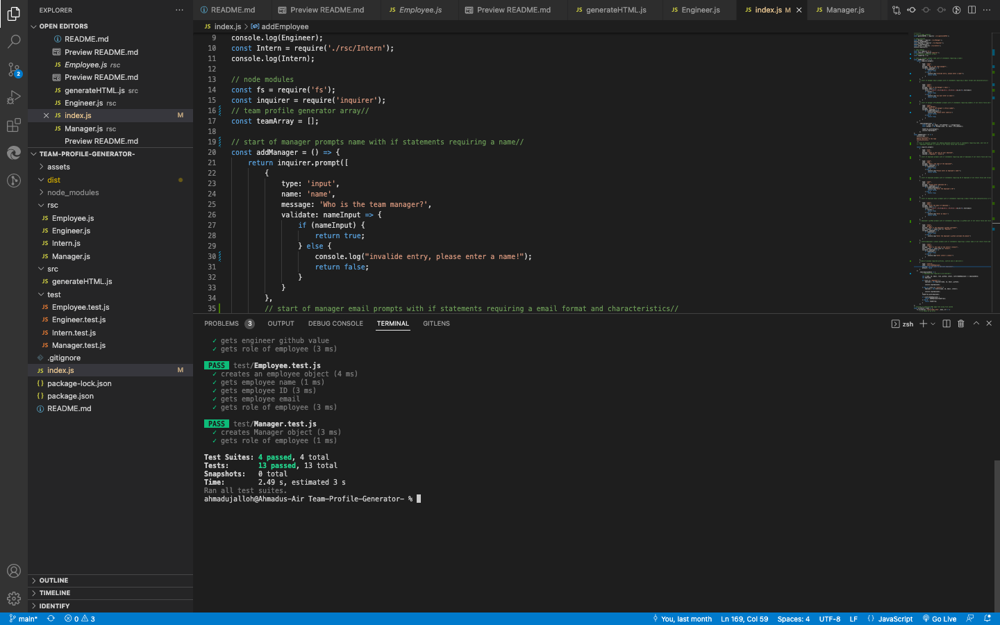
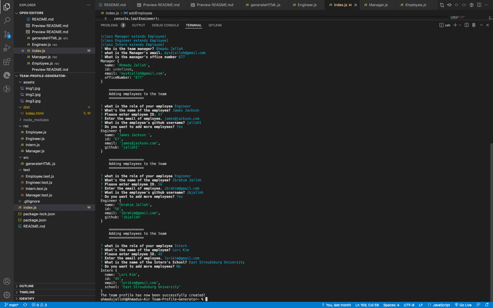
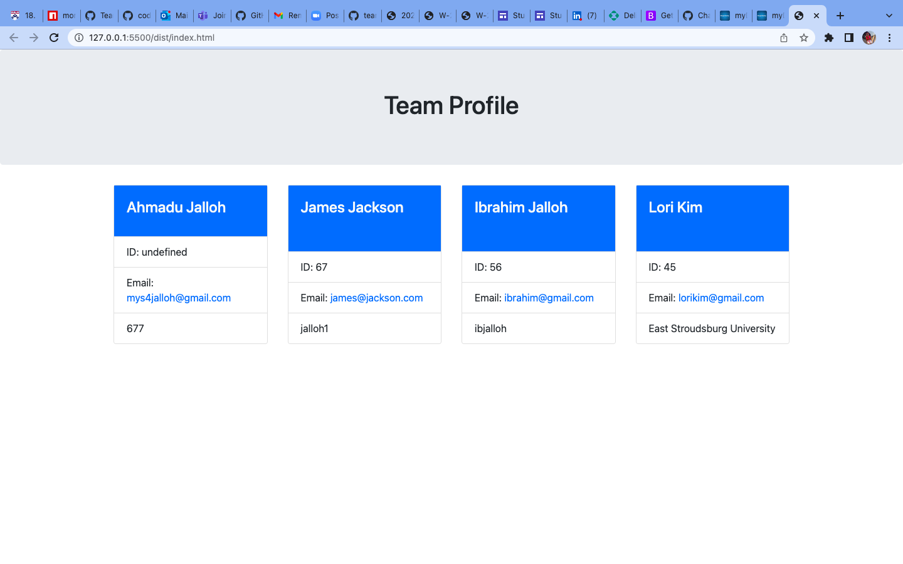

## Table of Contents

1. [Description](#description)
2. [Installation](#installation)
3. [Usage](#usage)
5. [Contributing](#contributing)
6. [Tests](#tests)

# Description
This is a team profile generator. The application provides questions prompts to be answered by the user. 
All the user needs to do is to answer the questions and a professional team profile generator is generated for them in a node js environment.

# Installation
To install the application, you will need to download the file in the repository, clone it and open the file in a code editor such as VS CODE.
 Open the right file in the terminal and run node then answer the prompt questions.

# Usage
Once the file is successfully installed, you can then follow up with running it in node. Answer all questions, some are required. 
Your file will be generated.
# Contributing
Contributions are welcome, please contact the author via github or email below. Thank you

## videoDemo: https://drive.google.com/file/d/1KpunJ5Mgyd5LlG7HyKEWN9A2TQwffntH/view
## git user https://github.com/Ajalloh1
